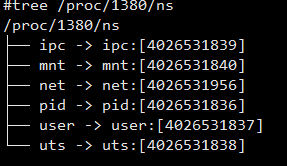
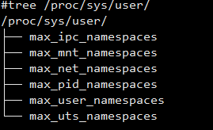

### 概念
Docker依赖Namespace和Cgroup实现了容器机制，namespace负责多个进程之间的资源隔离，cgroup限制单个进程的资源限制和监控(比如限制一个进程的IO和内存)。  
1、Namespace是一种内核级的环境隔离方法，使得处于不同的namespace的进程拥有独立的全局系统资源，修改namespace中的任意资源都只会影响当前的namesapce  
2、Linux 3.8以上支持pid namespace，系统中每个进程都有一个/prod/{pid}/ns这样一个目录，里面包含了这个进程所属的namespace信息  
3、当前Linux内核支持8中namespaces:

    mnt(mount points, filesystems)
    pid(process)
    net(network stack)
    ipc(System V IPC)
    uts(hostname)
    user(UIDs)
    cgroup(root directory)
    time(boot and monotonic)

### 查看进程所属的Namespace
> 查看PID为1380的ns目录，其中展示了6个namespace，如果两个进程的 ipc namespace 的 inode number一样，说明他们属于同一个 namespace

### Namespace Limit   
/proc/sys/user/中公开了对各种名称空间的数量限制  

  
### Namespace 存活时间    
  当一个namespace中的所有进程都结束或者移出该 namespace 时，该 namespace 将会被自动销毁。
  

### Network namespace  
Docker利用Network Namespace实现的4种网络模式  
host模式: 容器不会创建独立的网络环境，不会虚拟出自己的网卡，而是使用宿主机的IP和端口  
container模式： 和一个已经存在的容器共享IP和网卡。两个容器除了网络方面，其它如进程列表、文件系统还是独立的。两个容器都可以通过lo网络通信  
none模式： 容器拥有自己的network namespace，但是并不为容器进行任何网络配置，需要自己为容器添加网络和配置ip  
bridge模式: docker默认的网络设置，容器获得的网段与宿主机Docker0一致  
