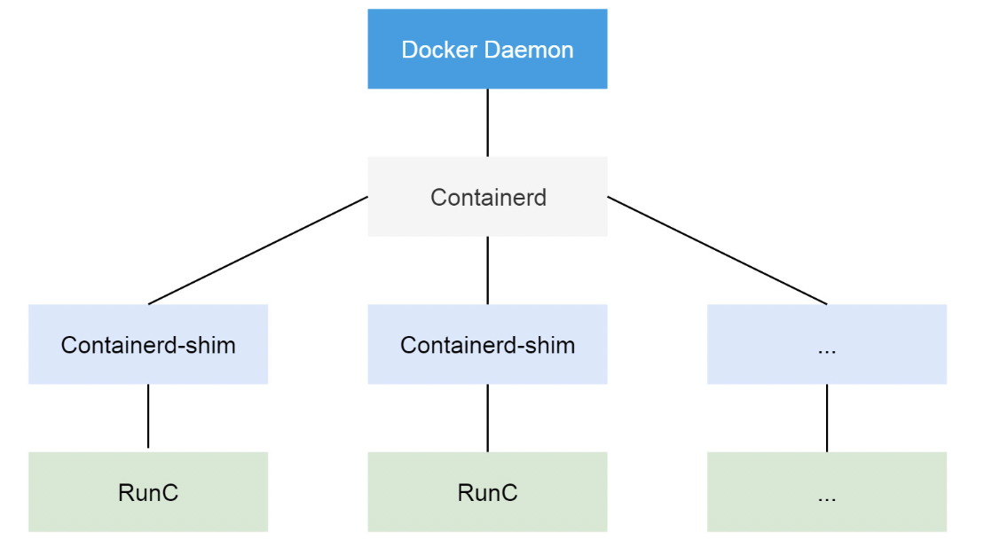

## Docker架构  

1、Docker Daemon守护进程负责Docker client端交互并管理镜像和容器  
2、containerd 就会负责集群节点上容器的生命周期管理，并向上为 Docker Daemon 提供 gRPC 接口  
3、containerd不会直接操作容器，会通过containerd-shim进程操作，我们指定容器进程是需要一个父进程作为状态收集、维持stdin和fd等，假设父进程是containerd的话，如果containerd怪盗，所有的容器都会退出，所以引入了containerd-shim  

## CRI
所有的容器运行时都提供CRI接口，CRI接口用于接入K8S管理，早期由于Docker的统治地位，没有按照OCI实现CRI接口，所以kubelet单独为docker增加了一个docker-shim。K8S调用docker逻辑如下   

刚开始containerd需要兼容swarm等，所以也没有实现CRI，随着k8s地位的上升，containerd也直线了CRI接口，调用逻辑简化如下  
  

K8S只是废除了docker-shim，如果Docker实现了CRI也可以正常接入K8S，但是Docker现在已经直接调用containerd，而containerd如今也实现了CRI接口，所以Docker也没有再增加CRI的必要了。