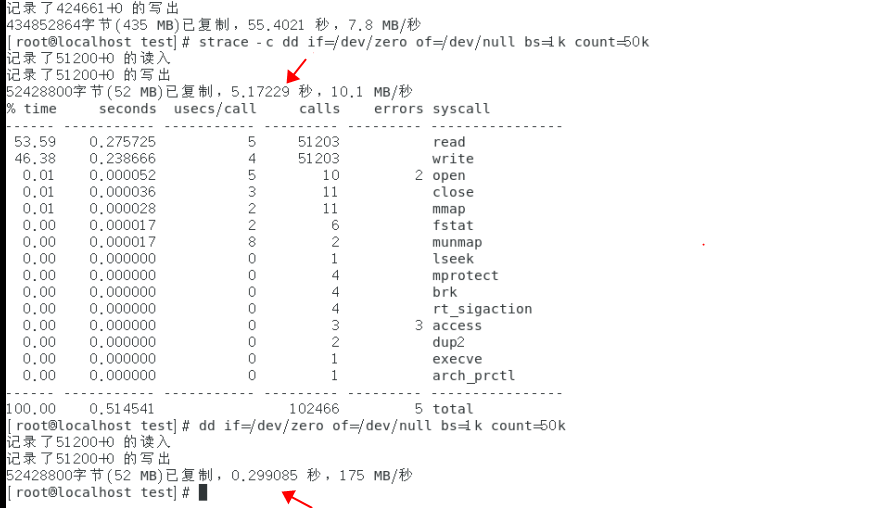

strace名是Linux中系统调用的跟踪器，为每个系统调用答应一行摘要，还可以统计系统调用并打印报告

跟踪PID为1884的系统调用
`strace -ttt -T -p 1884`
> -ttt 第一列打印为unix时间戳
> -T 打印最后一个字段time，该字段表示系统调用的持续时间
> -p PID 需要跟踪进程的ID，也可以执行为命令，这样strace就会启动并跟踪它

### 跟踪可能会造成过多的性能开销  

- strace采用了基于断点的跟踪，这为所有的系统调用的进入和返回都设置了断点，这是一种侵入式的做法，系统调用率高的应用程序可能会发现性能下降了一个数量级  

为了证明这一点，使用strace dd命令时带来了数十倍的性能差距，例:   
1、使用strace： `strace -c dd if=/dev/zero of=/dev/null bs=1k count=50k`  
2、取消strace：`dd if=/dev/zero of=/dev/null bs=1k count=50k`  

> time： 显示系统CPU时间活跃的百分比  
> second： 总的系统CPU时间，以秒为单位  
> usecs/call： 每次调用的平均系统CPU时间，单位是微妙  
> calls： 系统调用的数量  
> syscall： 系统调用的名称  

直接使用dd命令仅需0.29秒! strace跟踪后需要5.1秒

