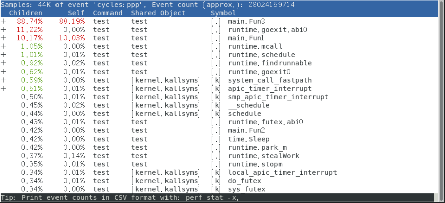
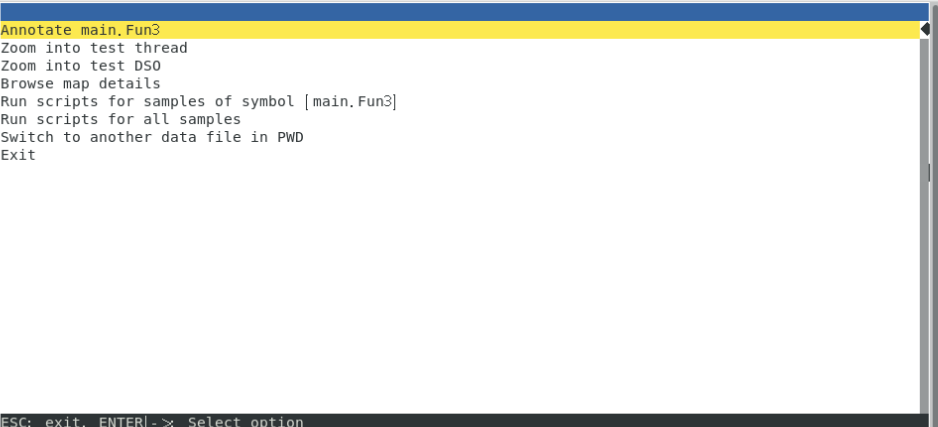
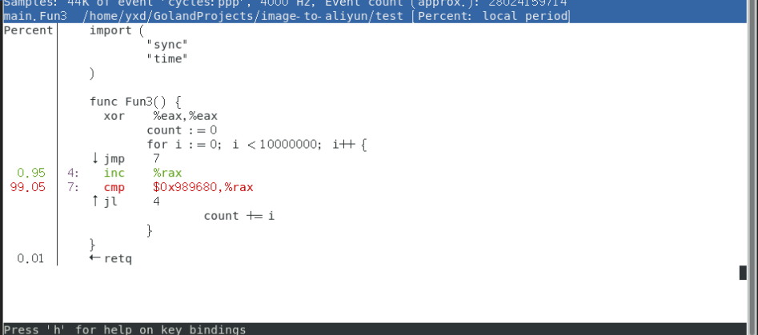
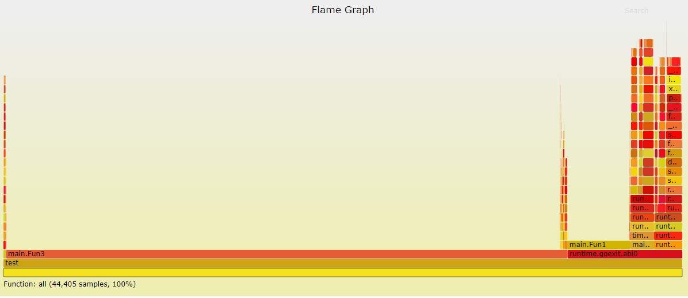

# 常见的性能分析工具
- ftrace
- perf
- systemTap
- ...

---

# 利用Perf性能分析

## perf简介
perf是Linux内核内置的性能分析器，能直接定位高级语言中（比如C/Go）的某个函数甚至某行的性能开销，原理是每隔一段时间就在CPU上产生一个中断，在中断上针对进程、函数附加统计值，这样就知道Cpu有多少时间消耗在哪个进程上,再通过反汇编将指令转换为可视化代码。  

简单点： 几乎所有的东西都可以使用跟踪器来跟踪和分析。比如TCP/IP过程、应用程序内部、系统内部等等。利用分析器你可以获得洞悉一切的能力，比如strace和tcpdump也可以理解为跟踪器，perf这类系统跟踪器可以获得更多的系统调用数据


## 什么时候需要Perf  
例：比如你写了一个应用，但是运行起来发现CPU使用率高，运行慢。一个新手可能会猜测哪一部分的代码有问题，或者花费大量的时间去静态分析代码。经验告诉我们这种做法非常低效！  
例：对于运维人员，研发最近修改了部分代码上线后，CPU使用率突增，查看所有应用源码这对运维人员来说显然工作量巨大且不现实

通过perf，你可以不需要修改代码，仅仅进行几次采样就可以快速找到任意内核，任意应用程序的性能热点，并且可以利用flame graph 生成火焰图   

perf采样理念诞生于2009年，采样这个方式在现分布式系统中也特别常见，比如我们会对整个分布式系统的所有调用链的响应情况做采样，以此为全链路监控提供数据支撑，以此来判断全局RT


## Perf开启零侵入式应用分析


> Perf 分析一个正在运行的程序

1.获得在运行的进程PID  


2.开始采样  
`perf record -g -p <PID>`  


3. 根据采样数据分析性能热点  
   `perf report`



图中可以看出88%的性能开销来自main.Fun3函数，10%的性能损耗来自Main.fun1函数  
输出结果：
- Overhead：指出了该Symbol采样在总采样中所占的百分比。在当前场景下，表示了该Symbol消耗的CPU时间占总CPU时间的百分比
- Command：进程名
- Shared Object：模块名， 比如具体哪个共享库，哪个可执行程序。
- Symbol：二进制模块中的符号名，如果是高级语言，比如C语言编写的程序，等价于函数名。

4. 分析函数中代码性能

我们光标移动到main.func3处，按回车会出现如下内容，然后再按回车




出现了具体的函数内容，内容是通过反汇编方式展示。这里可以看着我们99%的性能损耗来自for循环  


5. 附加：生成火焰图

>> 命令git仓库：https://github.com/brendangregg/FlameGraph.git

```
1.用perf script工具对perf.data进行解析  
`perf script -i perf.data &> perf.unfold`  
2.将perf.unfold中的符号进行折叠  
`./stackcollapse-perf.pl perf.unfold &> perf.folded`  
3.最后生成svg图：  
`./flamegraph.pl perf.folded > perf.svg`  
```





## 测试程序

## 分析测试程序

test测试程序[下载地址](https://itgod.org/book/test "下载"):  `https://itgod.org/book/test`
采样后会在当前目录下生成一个perf.data文件， Ctrl+C终止采样

- 启动./test应用，并开始性能采样  
`perf record -F 999 ./test`  

- 针对所有进程进行采样(-g可以生成火焰图)   
  `perf record -g -a`
  
- 对正在运行的应用怎么办？可以指定的Pid进程采样
  `perf record -g -p <PID>`

### 分析采样文件输出性能报告（能定位到具体的函数）
默认根据当前目录下的perf.data输出报告
`perf report `  

输出结果：
- Overhead：指出了该Symbol采样在总采样中所占的百分比。在当前场景下，表示了该Symbol消耗的CPU时间占总CPU时间的百分比
- Command：进程名
- Shared Object：模块名， 比如具体哪个共享库，哪个可执行程序。
- Symbol：二进制模块中的符号名，如果是高级语言，比如C语言编写的程序，等价于函数名。

### 附加: 输出性能报告（定位到具体行）
`perf annotate --stdio --symbol=main.chFunc`

### 生成火焰图

命令git仓库：https://github.com/brendangregg/FlameGraph/  
1.用perf script工具对perf.data进行解析  
`perf script -i perf.data &> perf.unfold`  
2.将perf.unfold中的符号进行折叠  
`./stackcollapse-perf.pl perf.unfold &> perf.folded`  
3.最后生成svg图：  
`./flamegraph.pl perf.folded > perf.svg`  
