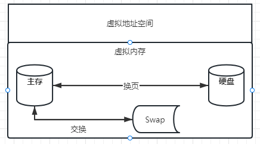

## 术语

主存：CPU可以直接访问的内存，存放正在使用的程序和数据的存储器  
虚拟内存：虚拟内存是一个抽象的概念，并不是真正的内存，是操作系统在内存和硬盘之间模拟出的一种内存空间，内存不足时临时用作数据缓存（图1.1）  
页： 分页是磁盘和内存间传输数据块的最小单位  
缺页：当程序需要使用某个内存页面时，该页面不在物理内存中，需要从硬盘加载进内存，因此会导致系统的性能下降，由CPU的内存管理单元发出的中断(图1.1)。使用按需虚拟内存时，这是正常现象  
换页：在主存和存储设备之前交换页  
交换：Linux中的swap空间，是回收匿名页的唯一手段。将整个进程的内存页面都存储在硬盘上，它比换页的效率更低，因为它需要将进程的所有页都存储在硬盘上
常驻内存： 当前处于主存中的内存  
匿名内存： 无文件系统位置或者路径名的内存。他包括进程地址空间的工作数据，称为堆  
OOM: 内存耗尽，内核检测到可用内存低  
使用率：有多少内存被使用（一个系统可能报告只有10MB的可用内存，但实际上它存爱10GB的文件系统缓存，需要时能够立刻被回收利用，需要查询工具文档显示结果是否包含了文件系统缓存和非活动页）  
饱和度：页扫描、换页、交换和OOM牺牲进程性能，可作为内存压力的衡量

## 虚拟内存

(图1.1)

## 分析方法
### 工具法
使用可用工具，检查它们显示的关键指标    
页扫描： 寻找连续的页扫描（超过10秒），它是内存压力的预兆，在Linux中可以使用sar -B检查pgscan列   
压力滞留信息： 查看/proc/pressure/memory可以检查内存压力（饱和度）统计  
交换： 内存页的交换是系统内存不足的体现，可以使用vmstat检查si和so列    
OOM： 通过/var/log/message或者dmesg信息中中搜索 “Out of memory”    
perf/bcc/bpftace： 通过跟踪内存分配，确认内存消耗的原因。需要注意的事，这会产生大量的开销。一个低能耗但是比较粗糙的解决方案是通过CPU剖析搜索分配代码的路径  
### USE法
检查使用率  
检查饱和度  
检测错误  
### 正确描述内存的使用情况
例： 该系统又256G内存，只有1%被进程使用，30%是文件系统缓存。用量最大的进程是数据库，消耗了2GB的主存（RSS）

## 内存交换分析

内存换入换出
`sar -B` 换页统计信息

## Perf分析

缺页采样（RSS增长）以及其栈跟踪,记录PID 1932进程在60秒内发生的所有缺页和栈跟踪  
`perf record -e page-faults -c 1 -p 1932 -g -- sleep 6-`  
因为缺页是随着进程的RSS增长而发生的，因此分析它们可以解释为什么进程的主存在增长，可以了解的内存使用过程中的缺页故障  
`perf script` 查看栈情况  
缺页火焰图同CPU火焰图  

跟踪kswapd唤醒事件    
`per record -e vmscan:mm_vmscan_wakeup_kswapd -ag`  

## drsnoop分析
drsnoop是一个bcc工具，用于跟踪直接通过内存回收释放内存的方法，显示受影响的进程和延时，他可以用来量化内存受限系统对应用性能的影响  
`drsnoop -T`  

## bpftrace分析
bpftrace 是一个基于bpf的跟踪器    
按用户栈和进程对libc malloc()请求量求和，得到高开销  
`bpftrace -e 'uprobe:/usr/lib64/libc.so.6:malloc { @[ustack, comm] = sum(arg0); }'`
> 指定进程 `bpftrace -e 'uprobe:/usr/lib64/libc.so.6:malloc /pid == 181/ { @[ustack, comm] = sum(arg0); }'`  
> 按字节显示，方式为2的幂次方直方图 `bpftrace -e 'uprobe:/usr/lib64/libc.so.6:malloc /pid == 181/ { @[ustack, comm] = hist(arg0); }'`  

