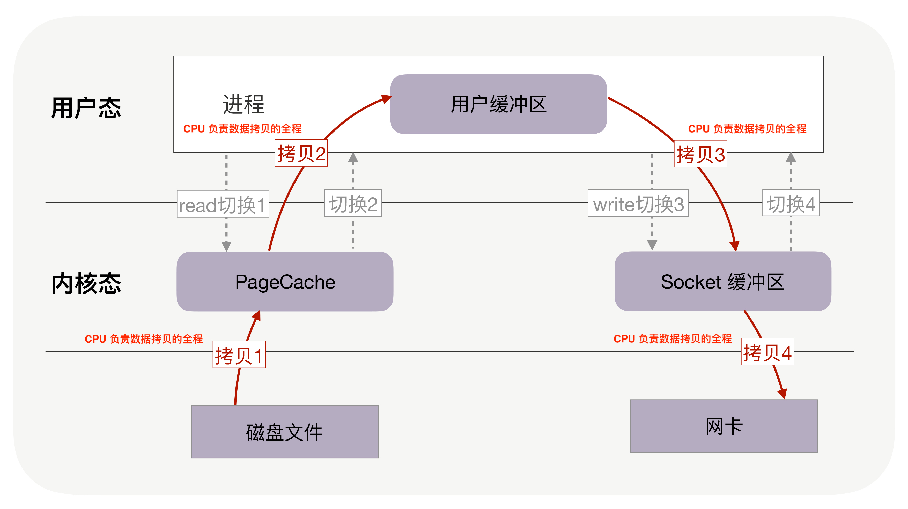

## 浅拷贝  
应用内存地址，源数据发生变化后拷贝的对象也发生变化  

## 深拷贝  
完整复制内存数据，源数据发生变化不影响拷贝后的数据

## 零拷贝  

用户进程拥有用户空间的缓存区;CPU操作文件时无法直接从磁盘中读取，而是从内存读取。  
读取一个文件并将文件内存发送的过程是 磁盘文件->内核态PageCache->用户缓冲区->socket缓冲区->网卡。如下图，进行了4次数据拷贝，以及4次上下文切换

之后出现了DMA技术，简单理解，DMA就是在主板上有一块独立的芯片。在进行内存和IO设备数据传输的时候，直接通过DMA搬运。不需要CPU去处理Copy
零拷贝技术是一个思想，指的是指计算机执行操作时，CPU 不需要先将数据从某处内存复制到另一个特定区域。  
零拷贝技术的具体实现方式有很多，例如：
- sendfile
- mmap
- Direct I/O
- splice  
不同的零拷贝技术适用于不同的应用场景  
- DMA技术：DMA负责内存与其他组件之间的数据拷贝，CPU 仅需负责管理，而无需负责全程的数据拷贝；  
使用 page cache 的 zero copy：  
- sendfile：一次代替 read/write 系统调用，通过使用 DMA 技术以及传递文件描述符，实现了 zero copy；
- mmap：仅代替 read 系统调用，将内核空间地址映射为用户空间地址，write 操作直接作用于内核空间。通过 DMA 技术以及地址映射技术，用户空间与内核空间无须数据拷贝，实现了 zero copy；
不使用 page cache 的 Direct I/O：读写操作直接在磁盘上进行，不使用 page cache 机制，通常结合用户空间的用户缓存使用。通过 DMA 技术直接与磁盘/网卡进行数据交互，实现了 zero copy；

案例：  
1、Kafka接收消息并持久化时，使用 mmap 机制，能够基于顺序磁盘 I/O 提供高效的持久化能力  
2、发送消息时，使用sendfile机制  

## DMA技术