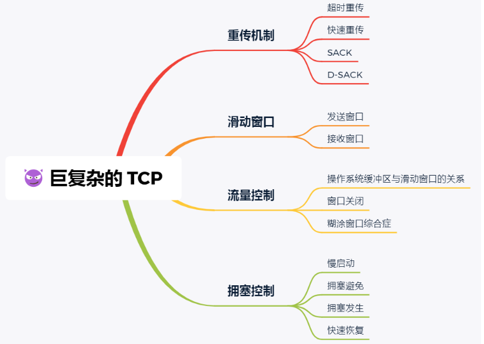
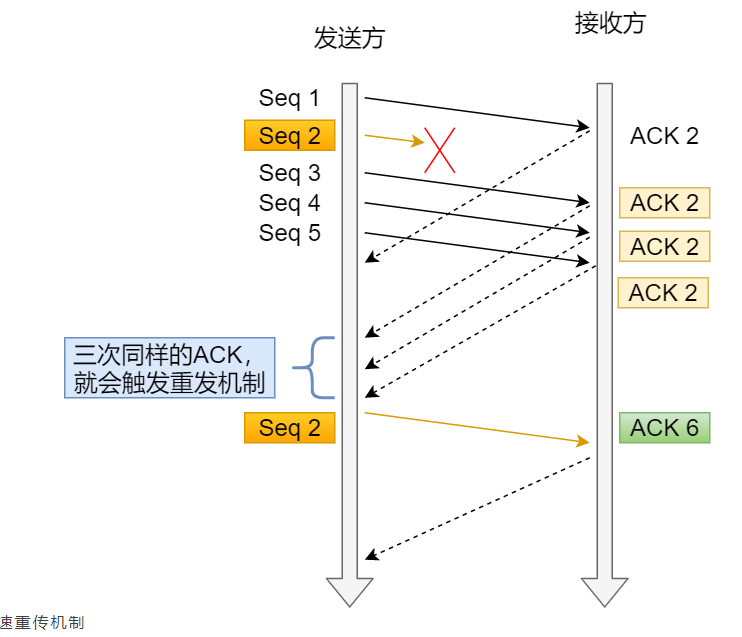

## 知识图谱
TCP通过以下机制保障了可靠性  

## TCP握手和挥手

### TCP为什么需要3次握手  
1、客户端发送SYN请求到服务端(目的：服务端会知道客户端拥有发送数据的的能力)  
2、服务端回复SEND_SYN请求和ACK（目的：客户端会知道服务端拥有接收合发送的能力）  
3、客户端发送ACK（目的：服务端会知道客户端有接收能力）  

### TCP为什么需要4次挥手

## 重传机制

### 超时重传  
理论上每个发送的数据包都会收到服务端回复的ack确认应答报文，如果在特定的RTO内(RTO值根据RTT时间+算法得出)，没有收到确认报文则触发超时重传  
缺陷：如果网络延迟很高或者丢包率很高，每次都要等待超时触发重传。这会降低传输效率
### 快速重传  
快速重传弥补了超时重传的缺陷，不以时间为驱动，以数据为驱动。例：  

1、第一份seq1到达服务端，于是回复ack=2  
2、但是seq2由于丢失导致没有收到，seq3到达了，于是ack还是回2  
3、后面的 Seq4 和 Seq5 都到了，但还是 Ack 回 2，因为 Seq2 还是没有收到；  
4、发送端收到了三个 Ack = 2 的确认，知道了 Seq2 还没有收到，就会在定时器过期之前，重传丢失的 Seq2  
5、最后，收到了 Seq2，此时因为 Seq3，Seq4，Seq5 都收到了，于是 Ack 回 6   
缺陷： 重传的时候，不知道是重传一个数据还是重传所有的数据

### SACK
这种方式需要在 TCP 头部「选项」字段里加一个 SACK 的东西，它可以将缓存的地图发送给发送方，这样发送方就可以知道哪些数据收到了，哪些数据没收到，知道了这些信息，就可以只重传丢失的数据。  

如果要支持 SACK，必须双方都要支持。在 Linux 下，可以通过 net.ipv4.tcp_sack 参数打开这个功能（Linux 2.4 后默认打开）。

## 滑动窗口  
网络中理想情况是客户端每发送一个报文，就要等待服务端回复一个接收报文，然后再开始下一次网络传输。这种情况下，RTT往返时间越长，那么传输效率就越低，所以滑动
窗口就是值无需等待确认应答，继续发送数据的最大值。  
窗口的实现实际上是操作系统开辟的一个缓存空间，发送方主机在等到确认应答返回之前，必须在缓冲区中保留已发送的数据。如果按期收到确认应答，此时数据就可以从缓存区清除

## 流量控制
如果一直无脑的发数据给对方，但对方处理不过来，那么就会导致触发重发机制，从而导致网络流量的无端的浪费  

## 拥塞控制  
当网络质量较差时，恶性循环下触发大量的重传等机制，就会造成更大的网络负担  

引用： `https://www.cnblogs.com/xiaolincoding/p/12732052.html`